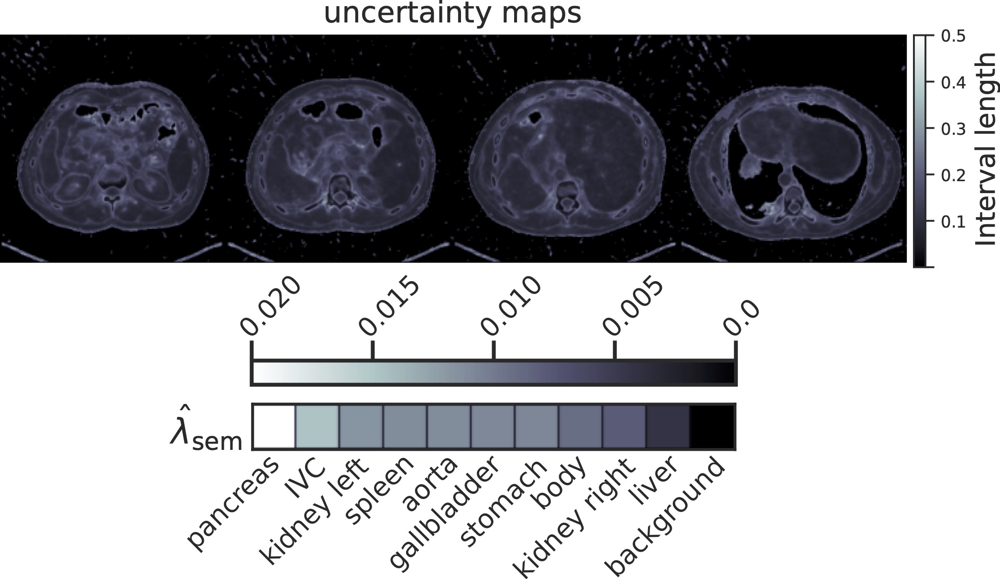
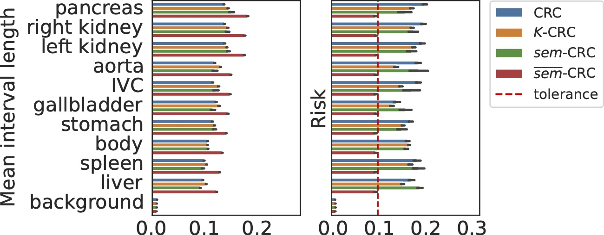

# Conformal Risk Control for Semantic Uncertainty<br/>Quantification in Computed Tomography

This is the official implementation of the paper [*Conformal Risk Control for Semantic Uncertainty Quantification in Computed Tomography*](https://arxiv.org/pdf/2503.00136)

by [Jacopo Teneggi](https://jacopoteneggi.github.io), [J Webster Stayman](https://scholar.google.com/citations?user=pn8ZDP4AAAAJ&hl=en&oi=ao), and [Jeremias Sulam](https://sites.google.com/view/jsulam)

---

## Overview

*sem*-CRC measures the reconstruction uncertainty in semantic structures while ensuring coverage of the ground-truth image.



Furthermore, *sem*-CRC allows to control risk at the same level for each structure.



---

## Usage

### Install Dependencies

This project relies on the *K*-RCPS package available at [Sulam-Group/k-rcps](https://github.com/Sulam-Group/k-rcps). To install it, run:

```shell
$ cd ..
$ git clone https://github.com/Sulam-Group/k-rcps.git
$ cd k-rcps
$ python -m pip install .
```

Download datasets:
